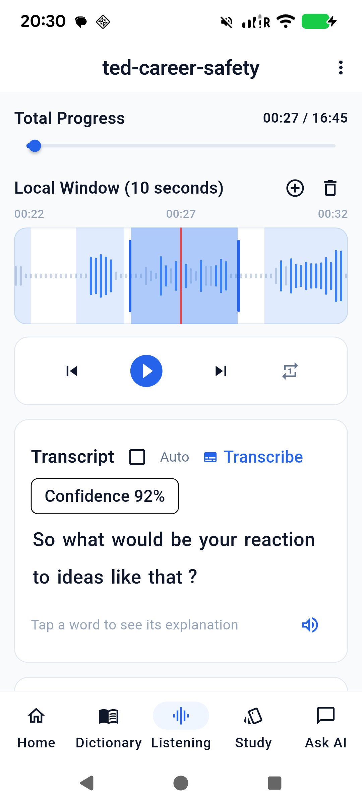

# Conservative speech segmentation — 2026-09-06

## Problem and changes

Quiet, quickly spoken sentence openings were clipped, and ordinary hesitations
created too many small cuts. Both Android waveform extraction and Dart WAV
extraction imposed a 0.02 amplitude floor for display. The same values fed the
speech detector, inflating its estimated noise floor and hiding quiet phonemes.

- Preserve real PCM peak energy, including zero; minimum visible bar height stays
  in the waveform painter. Version the peak cache to v4 so old floored data is
  extracted again without replacing saved cuts.
- Merge raw pauses up to 650 ms before applying padding. Keep 400 ms of leading
  context and 250 ms after speech, sharing only the silent gap when neighbors
  would overlap. Long silent gaps remain outside cuts.
- Use a soft 16-second length threshold: longer groups may split at their
  strongest internal pause of at least 350 ms, with at least 2.5 seconds on each
  side. Continuous speech is never split at an arbitrary timer boundary.
- Keep the waveform preparation indicator visible until detection and persistence
  finish, instead of temporarily declaring that the file has no speech cuts.
- Remove an unnecessary blocking read after each decoded Android audio frame.
  This fixes a substantial MP3 decoding delay before selected-cut transcription.

Saved manual cuts remain authoritative. Existing lessons require **Lesson options
→ Redo segments** to adopt the new algorithm. Auto OFF still hides cached text
until **Transcribe** is tapped.

## Supplied audio and reproducible checks

Source: `test_artifacts/Career stability isn't career safety—here's why _ Andreas
Gebhardt _ TEDxGraz.mp3` (40,208,855 bytes, approximately 16:45).

SHA-256: `60e07e2e7ab831ef79ee782523e690867a607239067edd8f3fbea0bd342a0ea4`.

The full file was decoded locally into a 50 ms peak envelope. A local Whisper
large-v3-turbo run helped locate the reaction question at approximately 26–29
seconds; no source audio was uploaded. The committed regression fixture contains
only amplitude values from seconds 10–60.

| Full-file envelope audit | Previous detector | New detector |
| --- | ---: | ---: |
| Cuts | 263 | 139 |
| Median duration | 1.86 s | 4.451 s |
| Reaction-question bounds | 26.370–29.030 s | 25.999–29.250 s |

These statistics describe the host PCM envelope. Android decoding can produce
slightly different peaks. Fewer cuts alone is not evidence of grammatical
correctness; regression checks also cover quiet onsets, 600 ms hesitations, long
silence, non-overlapping bounds, and uninterrupted speech.

## Pixel 6 verification

Device: `25311FDF6004PR`, Android 16. Imported the supplied MP3 as
`ted-career-safety`, preserving existing lessons and model files.

- With the new detector, native Whisper recognized the complete selected
  question: “So what would be your reaction to ideas like that?”
- The signed final upgrade preserved the lesson, cuts, position, and transcript
  cache. Auto OFF hid the saved question on reopening; tapping Transcribe
  displayed the cache.
- The test lesson is retained on the phone for review.
- Final-build recognition on a different, uncached cut returned “Do you have
  children?”. MediaCodec prepared the full MP3 in approximately 128 seconds
  (20:27:36.895–20:29:44.822 device time), compared with roughly ten minutes
  observed before removing the drain wait. This is a single-device measurement,
  not a general performance guarantee. The app stayed at PID `30766` and its
  crash buffer was empty.

## Automated checks and release

- `flutter analyze`: no issues, zero errors/warnings.
- `flutter test --concurrency=1`: 178 passed, zero failed.
- `flutter build apk --release`: succeeded using `app/android/key.properties`.
- `apksigner verify --verbose --print-certs`: verified; v2 signature true.
- Fixed artifact: `release/app-release.apk`, 93,260,625 bytes.
- APK SHA-256: `84B8C6228036A2B0D4F04055CF6D27CB2422593CA5304C84DEB22BE21E3EC9F9`.
- Signer SHA-256: `68:90:D4:8A:B8:F1:B2:60:83:92:FA:D0:F9:DF:FA:D9:D7:7F:12:57:55:4B:17:E2:A8:66:A7:D2:E7:D1:16:DA`.

The existing upstream flutter_tts future Kotlin compatibility warning remains;
the current release builds successfully. Previously blocked deletion of duplicate
APK build outputs was not retried or bypassed.

## Limits

This is acoustic phrase detection, not a grammatical sentence parser. Laughter,
music, background noise, and long uninterrupted speech can still require manual
adjustment. Longer phrases can contain multiple sentences. Native transcription
recognizes only the selected cut but currently decodes the full source file
before cropping its PCM, so long-source preparation still has overhead.
