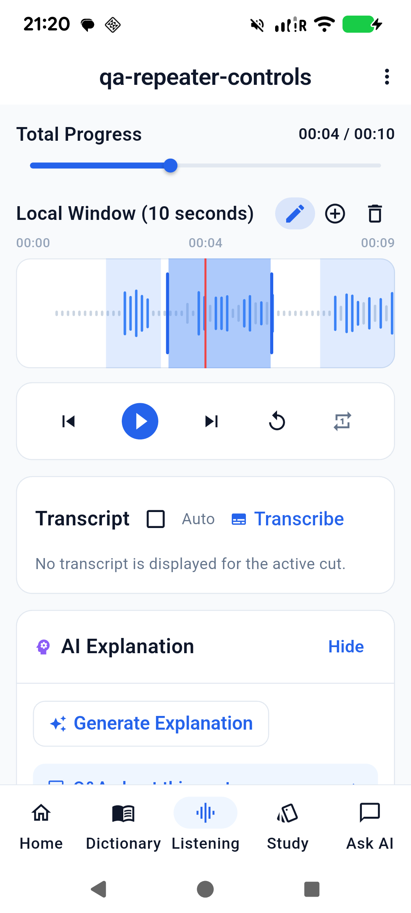
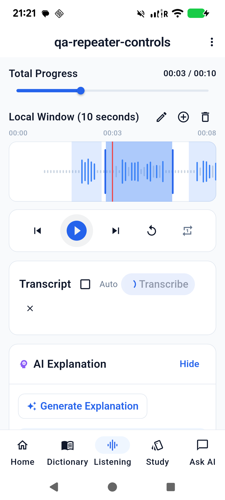
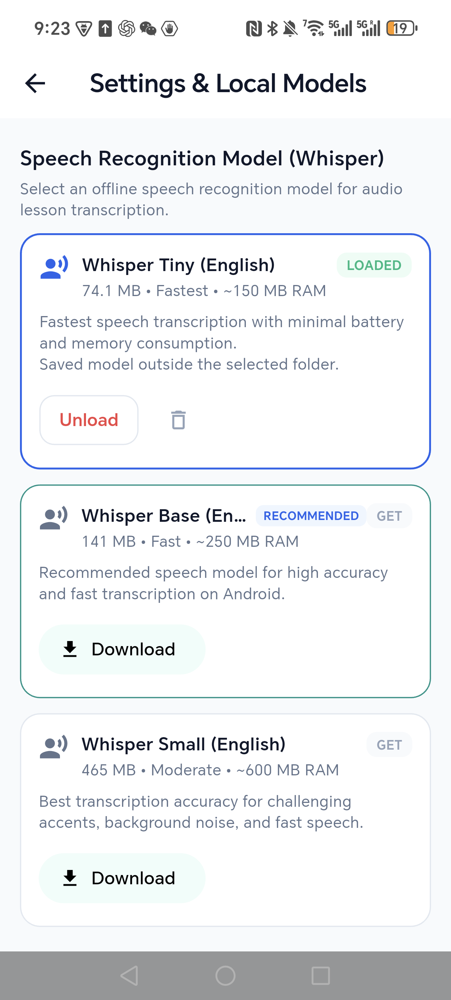
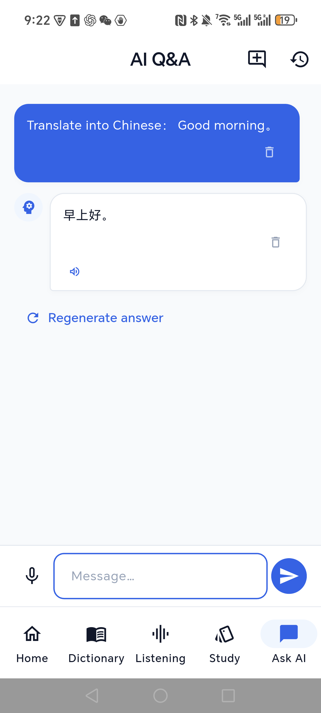

# Repeater controls and Honor model/inference fixes

## Requested behavior

- Replay is between Next and Repeat. It starts playback at the selected cut's
  beginning without changing repeat mode, including the explicit left-cut
  selection immediately after a split.
- Edit is immediately left of Add cut, initially inactive. Its highlighted state
  enables boundary dragging. With Edit off, the bars remain visible but cannot
  resize cuts; dragging the waveform still scrubs playback. A different lesson
  starts with editing off.
- Transcribe shows its spinner in the transcript card, with a percentage when
  native progress is available. The top Whisper status panel is removed. Duplicate
  requests are disabled while recognition/cancellation is pending, cancellation
  remains available, and failures appear in the transcript card.

## Honor PTP_AN00: incorrect AI output

The failure was reproduced in a new chat using the built-in say/tell question.
The loaded Qwen2.5 1.5B file was intact: 1,117,320,736 bytes, SHA-256
`6a1a2eb6d15622bf3c96857206351ba97e1af16c30d7a74ee38970e434e9407e`.

Although Settings reported CPU, native model initialization supplied a null
device list and left operation/KQV offloading enabled. Null means automatic
device discovery to llama.cpp. Zero GPU weight layers therefore did not prevent
GPU compute: the baseline logs included a 482 MB Vulkan compute buffer and 396
graph splits during prompt processing. That unintended hybrid path produced
incorrect output on the Honor device.

CPU initialization now supplies an explicit empty accelerator list and disables
operation/KQV offloading. Deterministic tests using the same model and runtime
produced `4` for 2+2, a coherent say/tell explanation, and `早上好。` for a Chinese
translation. Fixed native logs showed one CPU backend and one graph split. The
SAF file-descriptor loading path was also exercised.

This fixes the observed execution defect. It does not establish general model
accuracy or validate all Vulkan workloads on this device.

## Model inventory

Settings previously listed only files found in the selected model directory.
Startup restoration independently loaded saved paths, including legacy private
storage, so a working speech model could be absent from every settings row.
The inventory now reconciles current-folder files with loaded and saved paths,
reads private filesystem and SAF document metadata, and uses exact filenames
when matching catalog variants. It also displays loaded models without a new
storage folder, refreshes on entering Settings, and retains the previous list
with a retry message if a provider scan fails.

## Device checks

- Pixel 6 (`25311FDF6004PR`, PID `31723`): imported a temporary 10-second WAV
  excerpt of the supplied TED audio. With Edit off, a drag left the boundary
  columns exactly at x=437–443 and x=760–766; with Edit on, the right boundary
  and shading moved together. Replay returned from approximately 5.3 seconds to
  the active cut start at 3 seconds, started playback, and left Repeat off.
- Manual native Whisper recognition showed the spinner inside Transcribe and
  returned the full reaction question. The old top progress panel was absent.
  The crash buffer remained empty. The temporary QA lesson and copied source
  were removed afterward; existing lessons/models were preserved.
- The exact final release native library passed the Honor CPU smoke test,
  including descriptor loading and the arithmetic/translation assertions.
- Honor PTP_AN00 (PID `13889`): fresh Ask AI chats produced relevant say/tell
  prose and translated Good morning to `早上好。`. Settings correctly showed
  Qwen2.5 1.5B and Whisper Tiny (English) as LOADED; the Whisper row identified
  its saved location outside the selected folder. The crash buffer was empty.
  Some model explanations remained overbroad, so these samples establish
  recovery from corrupt inference rather than universal semantic accuracy.

## Automated checks and signed release

- `flutter analyze`: no issues, zero errors/warnings.
- `flutter test --concurrency=1`: 187 passed, zero failed.
- `flutter build apk --release`: succeeded using `app/android/key.properties`.
- `apksigner verify --verbose --print-certs`: verified, v2 true.
- `release/app-release.apk`: 93,326,253 bytes.
- APK SHA-256: `B0466185951A0A124C41D9A9FE27D432498B7799C06CA3B40AB6514FF61CF4A5`.
- Signer SHA-256: `68:90:D4:8A:B8:F1:B2:60:83:92:FA:D0:F9:DF:FA:D9:D7:7F:12:57:55:4B:17:E2:A8:66:A7:D2:E7:D1:16:DA`.
- Signed upgrades succeeded on both phones. The existing upstream flutter_tts
  Kotlin compatibility notice remains; it does not prevent the build.
- Prior blocked deletion of duplicate APK build outputs was not retried or
  bypassed. The fixed release artifact is current.
