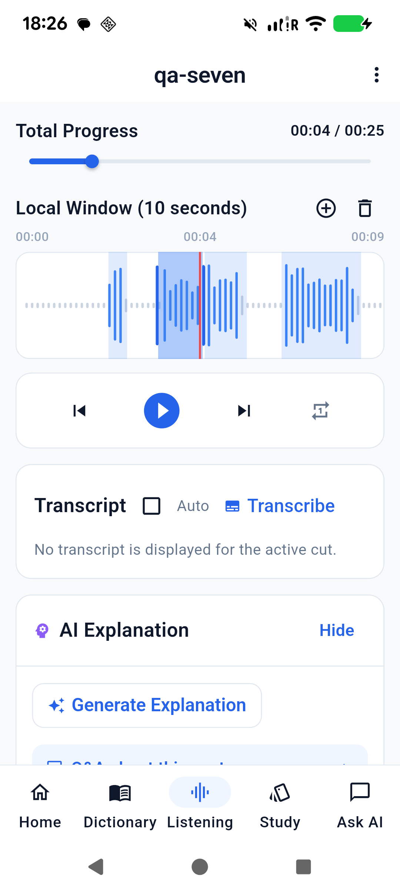
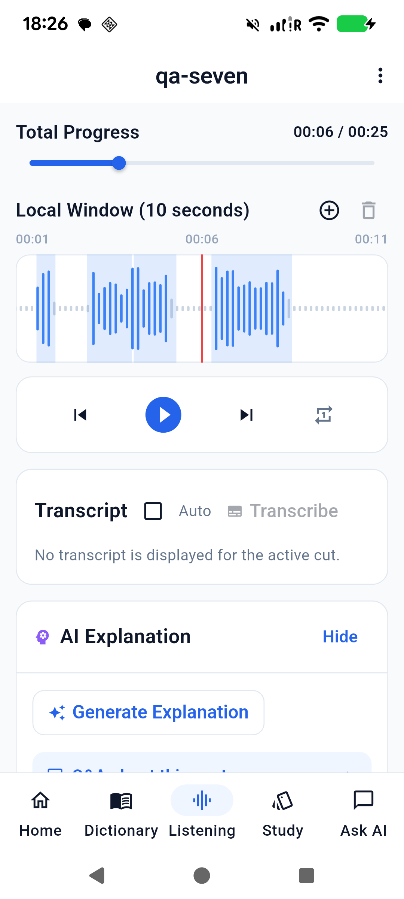
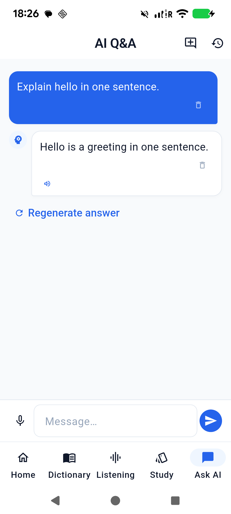

# Seven requested UI and behavior fixes — 2026-09-06

Validated on Pixel 6 (`25311FDF6004PR`, Android 16) with the existing Qwen2.5 0.5B and Whisper Tiny models. Incremental Dart changes used hot reload/restart; the final signed release was installed in place and tested again.

## Implemented behavior

| Request | Result |
| --- | --- |
| Segment handles and shading disagree | Handles have an explicit width and use coordinates relative to the plot. Drag previews use the same revision-aware cut editor as persistence, including compressed overlapping neighbors. Lines mark the exact audio bounds; shading is inset by 10 ms or at least one logical pixel on each side, leaving a tiny white gap between touching cuts. Audio timing is not shortened by the visual inset. |
| Waveform jumps during playback | Peak groups are anchored to the file timeline and cached. Playback only changes their horizontal positions; sample membership and amplitude stay fixed. |
| Silence need not belong to a segment | Adaptive energy segmentation retains speech regions and excludes substantial silent gaps. Short adjacent speech regions are merged before minimum-length filtering. |
| Persistent manual edits and clearer actions | The Listening toolbar now has a three-dot menu: Import audio, Redo segments, Reset transcripts. A SHA-256 fingerprint recognizes reimported identical audio, including renamed files. Persisted cuts, including an intentionally empty cut list, take precedence over automatic segmentation. Only explicit Redo segments replaces them. Reset transcripts clears this lesson's per-cut caches while retaining its cut bounds. |
| Strict per-segment transcript visibility | Auto OFF hides text on load, segment change, and disabling Auto. Transcribe explicitly reveals a valid cached result or runs recognition for the current cut. Bounds/revision changes invalidate the affected text and AI explanation. Edits/resets cancel and await pending transcription before committing, preventing late results from restoring old text. |
| Full Ask AI chat workflow | Persistent conversations, new chat, history switching, conversation/message deletion, stop, and regeneration. Stop retains received text and removes an empty pending answer. Regeneration replaces the latest answer and includes the current question exactly once. History selection reloads the latest saved state so an earlier sheet snapshot cannot overwrite new tokens. Removed the imperfect-responses footer. The system prompt follows the question's language and respects explicit translation-language requests. |
| Android Back navigation | Settings/context routes pop normally. Main tabs return through their visited history to Home. The first root Home back shows an exit prompt; a second press within two seconds exits. |

The redundant Listening import floating button was removed, and the import notification expires without an unnecessary Open action that could remain over the chat composer.

## Device evidence

- A 25.967-second WAV test fixture produced six speech regions: `2266–2827`, `3615–6073`, `6960–9169`, `15749–16309`, `17097–19505`, and `20393–22651 ms`. The `9169–15749 ms` silent interval was excluded.
- Dragged the first segment's end from `2827` to `3471 ms`, then split the next segment at `4679 ms`. Database inspection confirmed revised bounds and cleared transcript metadata. Reimporting the same file preserved these edits and kept one lesson for the fixture.
- Reset transcripts incremented revisions and cleared text while retaining all seven edited bounds. Explicit Redo segments restored the six speech regions with new IDs.
- Whisper recognized `Hello` for the short first segment. With Auto OFF, manual Transcribe displayed the cache immediately; moving to another segment and back hid it again.
- Two playback frames showed the same wave shapes translating with the timeline. Regression tests compare shared waveform bars across a 73 ms viewport shift and assert exact handle/shade geometry during dragging.
- Chat generated an English answer, regenerated it without adding another question, created a new conversation, stopped a request before its first token, switched history, and deleted a conversation. The remaining conversation survived closing/reopening the app and upgrading to the final release. Release generation and deleting the last question/answer also succeeded; the history then displayed no saved conversations.
- Physical Back returned Settings → Home and Study → Dictionary → Home. The first Home press displayed the exit prompt; the next press closed the activity. Back also dismissed the new menus and history sheet normally.
- Final release smoke checks covered the menu, split rendering, Auto OFF hidden state, restored history, native generation, and message deletion. Installation succeeded; final application PID was `28599`, and the Android crash buffer was empty at verification.
- Removed the temporary test lesson, its source WAV on the device, and test conversations after verification. The two existing lessons remained in Home.

## Screenshots from the final release

## Checks and artifact

- `flutter analyze`: No issues found, zero errors/warnings.
- `flutter test --concurrency=1`: 171 passed, zero failed.
- `flutter build apk --release`: succeeded with `app/android/key.properties`.
- `apksigner verify --verbose --print-certs`: verified, APK Signature Scheme v2 true.
- Fixed artifact: `release/app-release.apk`, 93,260,625 bytes.
- APK SHA-256: `27B29C03814E01B36EF3C8E2FFE7EB022DDD51D990D4F14319D6F48B2E731A8C`.
- Signer SHA-256: `6890d48ab8f1b2608392fad0f9dffad9d77f1257554b17e2a866a7d2e7d116da`.

This pass changes transcript visibility from the earlier QA session according to the user's explicit preference. Language routing is covered by a Chinese-question regression test and English native-device generation; it does not guarantee the semantic accuracy of the small local model. Pause detection remains energy-based and may need manual boundary correction for noisy speech. The existing upstream `flutter_tts` future Kotlin compatibility warning does not prevent this release build.

The previous automatic approval rejection still prevents cleanup of duplicate APKs under `app/build/app/outputs/`; it was not bypassed. The designated release artifact above is current.
