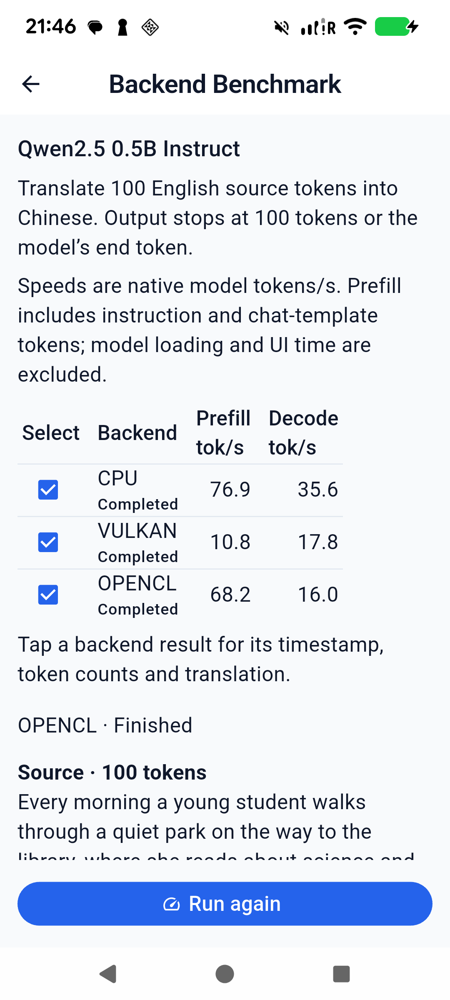
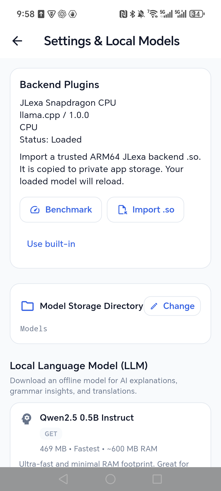
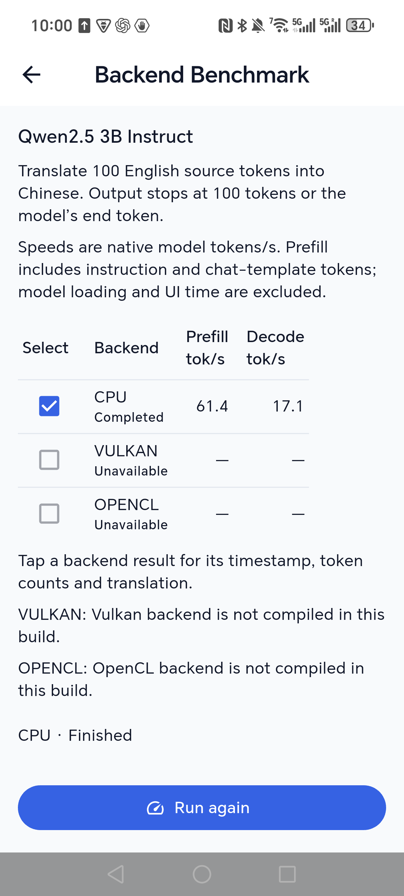
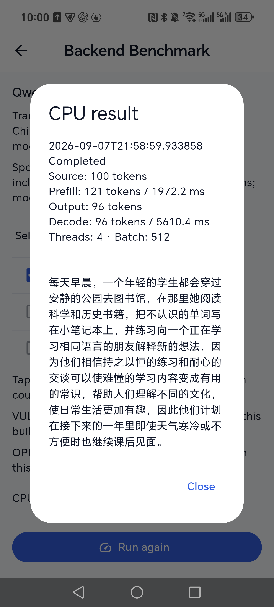

# Backend Benchmark verification — 2026-09-07

Settings → Backend Plugins → Benchmark opens the selected model's saved results.
Rows are the current plugin's CPU, Vulkan and OpenCL devices; available rows are
checked by default, unavailable rows explain why they cannot run. Rerun measures
only checked devices. Live source/translation, progress, Stop, and final per-row
rates are available. Tapping a result shows timestamp, actual counts, native
timings, runtime configuration and translation. History is separated by model
path and plugin identity, and survives process restart.

## Measurement

The optional stable C extension in `native/plugin/jlexa_benchmark.h` adds native
timing without changing inference ABI v1. Older plugins remain loadable and get
an explicit unsupported-benchmark message. Both the bundled llama.cpp adapter
and Snapdragon plugin implement the extension.

The engine tokenizes a fixed English passage, takes exactly 100 source tokens,
and verifies the text round-trips to 100 tokens. It applies the model's chat
template and requests Chinese translation with deterministic sampling, seed
1234 and a maximum of 100 output tokens. EOS may stop earlier. These Qwen
models have 121 total prompt tokens after instruction/template overhead.

Prefill and decode use synchronized native evaluation times, not elapsed UI
streaming time. Model loading, sampling and callbacks are excluded. Decode
counts actual single-token evaluations. Each UI row is one measurement without
a warm-up; first-run kernel preparation, clock/thermal state and model settings
affect rates. The separate Snapdragon comparison uses explicit warm medians.

## Pixel 6 — signed app, real Qwen2.5 0.5B through SAF

Device `25311FDF6004PR`, Android 16, Mali-G78. Existing models and three audio
lessons survived upgrades. Built-in/Auto was the original configuration.

| Device backend | Prefill tok/s | Decode tok/s | Result |
| --- | ---: | ---: | --- |
| CPU | 76.9 | 35.6 | Completed |
| Vulkan | 10.8 | 17.8 | Completed |
| OpenCL | 68.2 | 16.0 | Completed |

Context 2048, four threads, batch/microbatch 512. CPU/OpenCL completed with
source=100, prompt=121 and 93 generated/decoded tokens. OpenCL measured
1774.2 ms prefill and 5800.0 ms decode. The source and Chinese output were
visible; no claim of general model translation accuracy is made.

- First device pass exposed a SAF descriptor-offset problem during repeated
  loads. The benchmark now obtains a fresh ContentResolver descriptor for each
  device and for restoration, keeping each descriptor alive until its model is
  released. All three devices and restoration then succeeded.
- Confirmed the active runtime returns to Vulkan/Mali-G78 after finishing and
  stopping. Model loading is excluded from rates; tests never silently count a
  fallback device as the requested device.
- Stop during model loading is latched; it returns after loading/restoration.
  Stop during Vulkan decoding was captured at 12 seconds, changed the row to
  Stopped, and restored the model. Rerun remained available.
- Unchecking CPU and OpenCL ran only Vulkan. A repeat completed at 11.9/20.8
  tok/s, demonstrating normal run-to-run variation.
- Force-stop/relaunch restored the selected model and saved table. Partial and
  failed rows have no misleading speed values.
- Final APK repeated all three rows successfully at CPU **77.8/35.5**, Vulkan
  **10.8/17.3**, OpenCL **68.1/16.4** tok/s, then restored all values after a
  further force-stop/relaunch.

## Honor / Snapdragon

The independent plugin implementation and controlled 1.5B/3B comparisons are
documented in [the Snapdragon report](qa-snapdragon-backend-2026-09-07.md).
The ARM64 plugin is `release/jlexa-snapdragon-plugin.so`.

The phone originally selected Vulkan explicitly. Import initially fell back to
the built-in backend because that device is absent from the CPU-only plugin.
The import flow now checks the new plugin's devices and persists Auto when the
previous explicit choice is unavailable, retaining other runtime settings.
A regression test covers this transition and model restoration.

Final signed APK import succeeded on Honor PTP-AN00/SM8750 over wireless ADB.
Settings showed **JLexa Snapdragon CPU / llama.cpp / 1.0.0 / CPU / Loaded**.
The already-selected Qwen2.5 3B model loaded through SAF. The UI benchmark
completed at **61.4 prefill / 17.1 decode tok/s**, with source=100, prompt=121,
output/decoded=96, prefill=1972.2 ms and decode=5610.4 ms. It preserved the
user's four threads, context 2048, batch/microbatch 512 and Auto Flash Attention.
This app measurement differs from the controlled Flash-Attention-off warm
comparison in the other report; it is not used to claim a matched speedup.

After force-stop/relaunch, the external plugin and 3B model loaded again and
the Benchmark table retained 61.4/17.1. Final processes were Pixel 8334 and
Honor 22618. Existing models, lessons and conversations were retained.

On MagicOS, ADB-pushed `.so` files may not appear under the file picker's indexed
Downloads shortcut. The device-storage root **Magic7 → Download →
JLexa-snapdragon** exposes the actual file. The importer still copies it into
private read-only storage before loading.

## Automated coverage

Added tests for rate arithmetic, zero/partial metrics, default/available
selection, saved history separation, live output, cancellation ownership,
delayed/stale events, terminal-result recovery, restore errors, unsupported
plugins, corrupt prior history, narrow screen controls, and importing a
CPU-only plugin from a Vulkan preference. The existing settings rendering test
now explicitly awaits filesystem refresh instead of depending on a single
frame's disk-I/O timing.
The existing controller-generation/disposal test now uses the already available
in-memory chat repository to isolate that contract from SQLite write-queue
timeouts. Real database persistence tests remain in the suite.
The manager-ownership test also waits for inventory publication before its
disposal assertions, accounting for the constructor's concurrent initialization.
The existing Auto-transcription regression now waits for request restart and
the saved visible transcript with a bounded condition instead of assuming
450 ms/30 ms disk completion; its stale-result and ownership assertions remain.

## Release

- Signed APK: `release/app-release.apk`, 108,268,408 bytes.
- APK SHA-256: `DF79A8910C38D0560D49A9572BACBEEDF8C18DD5F36A3A7CFA6ECA37B4C6D1DC`.
- `apksigner verify --verbose --print-certs`: verified, APK Signature Scheme v2.
- Signer SHA-256: `6890d48ab8f1b2608392fad0f9dffad9d77f1257554b17e2a866a7d2e7d116da`.
- Refreshed importable bundled plugin: `release/jlexa-llama-plugin.so`,
  29,098,768 bytes; SHA-256 `2095C584C1A9162C92A5DA9C09F98DBE0CC038EF99713459637CF1960FF2B57F`.
- Snapdragon plugin: 4,136,496 bytes; SHA-256
  `264C75E5CBD1EECEBFF20E2FC928A826C0052FAB189A7268400DB88AAEF08E35`.
- Both physical phones received the final signed APK through in-place ADB
  upgrades. No app-data reset was used. The existing policy-blocked duplicate
  APK cleanup was not retried or bypassed.

Final static analysis: no issues. Final complete test run: **308 passed**, zero failed (`flutter test --concurrency=1`, 67 seconds).
