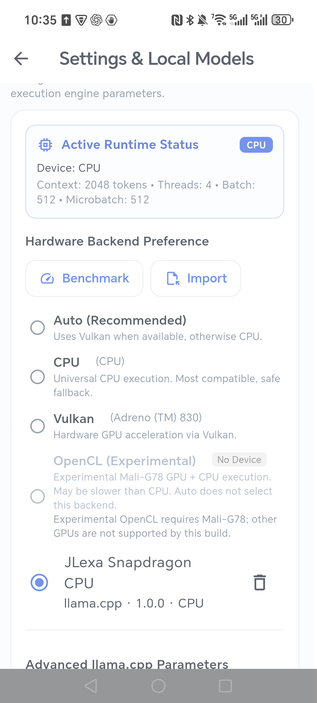
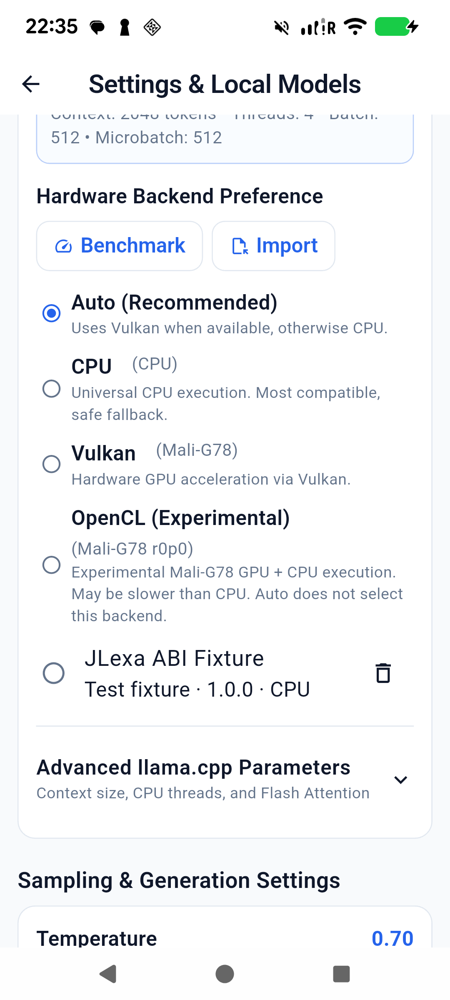
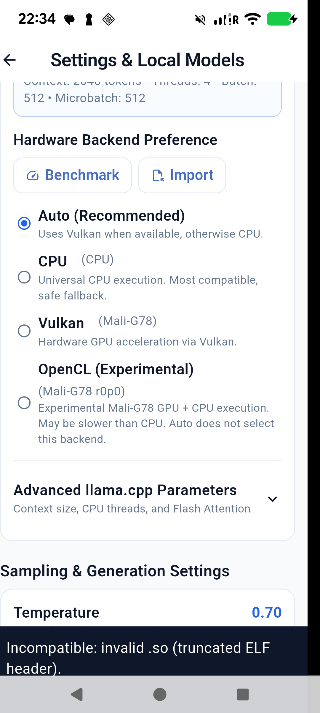
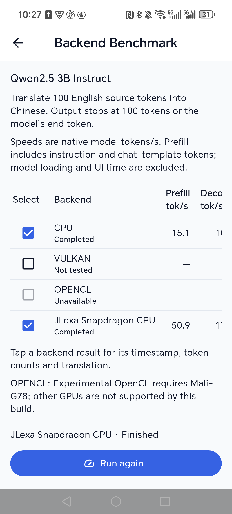

# Unified backend selection — 2026-09-07

Settings now contains one Hardware Backend Preference area with **Benchmark**
and **Import** actions. Imported libraries appear beside the built-in choices
and have individual delete icons. Import validates and adds a choice without
changing the current backend or unloading its model. Failed/cancelled imports
leave both the selection and catalog unchanged. Selecting an imported backend
reloads the current model; deleting the active import first restores built-in
Auto. The previous single-plugin preference migrates into the local catalog.

Benchmark lists built-in CPU/Vulkan/OpenCL and imported backends together,
checks available rows by default, and restores the original plugin/model after
completion or cancellation. Previous per-plugin measurements migrate into the
combined per-model history. The optional timing ABI and measurement workload
are unchanged.

## Physical verification

| Check | Evidence |
|---|---|
| Honor upgrade migration | Existing JLexa Snapdragon CPU remains selected with Qwen2.5 3B; previous 61.4/17.1 tok/s result appears in its row. |
| Successful import | Pixel imports the valid ABI fixture; current built-in Mali-G78 model remains loaded and Auto stays selected. |
| Multiple choices | Fixture and ARM64 baseline plugin coexist; importing the second retains the first and its active model. |
| Selection and restart | Selecting the fixture reports its CPU runtime; force-stop/relaunch restores that selection and model path. |
| Delete inactive | Deleting ARM64 baseline removes only that row and keeps the fixture selected. |
| Delete active | Deleting the fixture selects built-in Auto and reloads Qwen2.5 0.5B on Mali-G78; repeated on the final signed APK. |
| Invalid file | Truncated ELF is rejected in a readable Snackbar; final APK omits the PlatformException wrapper. |
| Wrong ABI | Actual x86_64 fixture rejected with expected arm64-v8a message. |
| Wrong version | API 99 rejected with expected JLexa API version 1 message. |
| Missing symbols | Missing jlexa_plugin_get_api rejected explicitly. |
| Load failure | Deliberately unresolved dependency rejected by dlopen. |
| Initialization crash | Deliberate abort is contained in the probe process; Pixel main PID stays unchanged and built-in model remains ready. |
| Cross-plugin benchmark | Honor completes built-in CPU and Snapdragon rows in one run and restores Snapdragon afterward. |
| Stop | Second Honor run is stopped during the imported row; UI returns to Run again and original backend is restored. Earlier successful result remains saved. |
| Missing timing extension | Pixel completes built-in CPU then marks the fixture Failed, with a result dialog explaining unsupported timing. Original fixture/model is restored. |
| Persistence after final upgrade | Honor restores Snapdragon and combined history; Pixel restores Auto with its existing models. |

Representative completed measurements (single runs, prefill/decode tokens/s):

| Device and model | Built-in CPU | Imported Snapdragon CPU |
|---|---:|---:|
| Honor PTP-AN00, Qwen2.5 3B | 15.1 / 10.0 | 50.9 / 17.1 |
| Pixel 6, Qwen2.5 0.5B | 77.1 / 35.6 | Not run |

These measurements depend on model, settings and temperature. Prefill includes
instruction/template tokens in addition to the 100 source tokens; output ends
at 100 tokens or EOS. Existing initialization containment and later native
crash limitations remain as documented in the plugin ABI README.

## Final release verification

- `flutter analyze`: No issues found.
- `flutter test --concurrency=1`: 313 passed, zero failures (74 seconds).
- Fixed an imported ListTile Material assertion found by the new widget test.
- Stabilized one existing model-manager test fixture by waiting for constructor
  initialization's inventory publication; application model logic is unchanged.
- `flutter build apk --release`: succeeded (62.2 seconds), release key configured.
- `apksigner verify --verbose --print-certs`: verified, v2 true.
- `release/app-release.apk`: 108,268,408 bytes.
- APK SHA-256: `66CA8C468D814A723EA6E2E154C0FDCFAE3BB1C039FA764505F7728FCA953DA6`.
- Signer SHA-256: `6890d48ab8f1b2608392fad0f9dffad9d77f1257554b17e2a866a7d2e7d116da`.
- Both `adb install -r` operations returned Success. Each phone's installed
  `base.apk` SHA-256 matches the release artifact exactly.
- Final main PIDs: Pixel `11488`, Honor `5537`; their crash buffers are empty.
- Temporary Pixel plugin rows/source fixtures removed. Pixel remains on
  built-in Auto; Honor retains its original Snapdragon plugin and 3B model.
  Existing models, lessons and conversations preserved.
- Prior automatic approval rejection of duplicate build-output APK deletion
  was not retried or bypassed. Pre-existing untracked `artifacts/` is untouched.

## Screenshots

