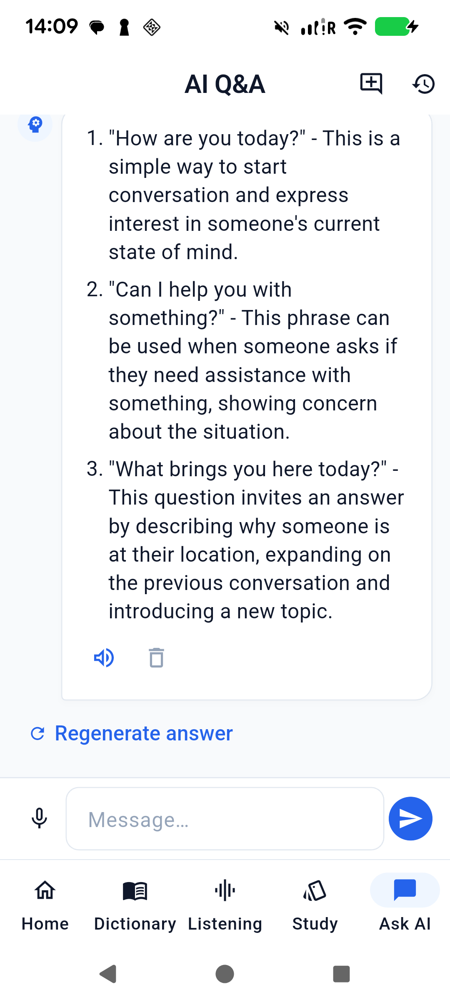
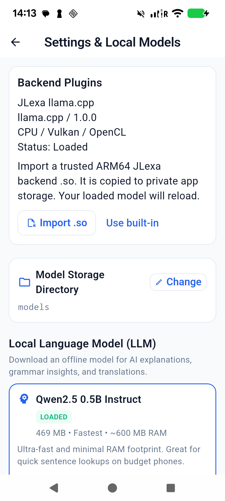
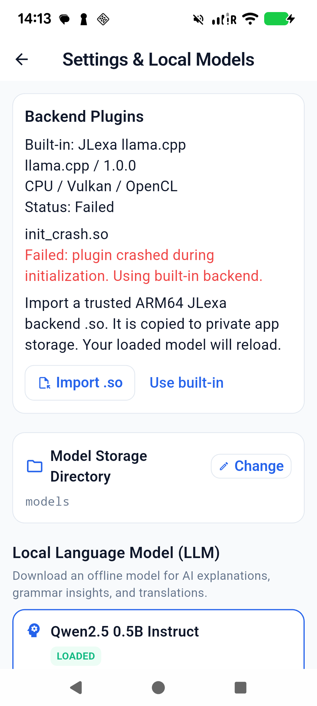

# Dynamic LLM backend plugins — Pixel 6 validation

Device: Pixel 6, `25311FDF6004PR`, Android 16, ARM64. Signed in-place
upgrades preserve the existing models, audio lessons, collection and vocabulary.

## Implementation

- Added the versioned C ABI and documented plugin author contract in
  [`native/plugin`](../native/plugin/README.md).
- Split llama.cpp into the bundled `libjlexa_llama.so` adapter. JNI/host calls
  the same function table for bundled and imported backends. Whisper retains
  its existing implementation. Engine symbols are hidden.
- Settings has a Backend Plugins card with file picker import, name, engine,
  plugin version, backend types, Loaded/Failed/Incompatible status, failure
  details and Use built-in.
- Imports stream into UUID-named files in private `no_backup/backend_plugins`,
  are made read-only before writing finishes, and are checked again before
  `dlopen(RTLD_NOW|RTLD_LOCAL)` / `dlsym`. External-storage paths are never
  executed. No downloader or dependency management was added.
- A disposable, non-exported probe process checks constructors, API version,
  required table entries, create and destroy. Binding death and timeouts reject
  the plugin. Selection/failure state and an initialization marker are persisted.
- Model reload/switching remains serialized with generation and cancellation.
  Native status reads run off the Android UI thread. Picker cancellation and
  failed imports restore the model; runtime status shows the actual backend.

## Physical test results

All imports below used **Settings → Import .so → Android file picker**. Files
pushed by ADB were selected under **Pixel 6 → Download → JLexa-plugin-tests**;
the Downloads provider did not list the ADB-pushed binary files directly.

| Scenario | Result |
| --- | --- |
| Built-in default/fallback | Qwen2.5 0.5B loaded through its persisted SAF URI; Auto selected Vulkan/Mali-G78 with context 2048, batch 512 and 4 threads. Chat returned three usable English phrases. |
| Valid small C ABI plugin | `valid.so` displayed JLexa ABI Fixture / Test fixture / 1.0.0 / CPU / Loaded. Chat returned exactly `JLexa ABI fixture response`. |
| Persisted selection | Force-stop and relaunch restored the fixture and loaded model, without another import. |
| Real engine plugin | Imported the actual ARM64 `libjlexa_llama.so` extracted from the release APK. Qwen loaded and produced a complete three-phrase answer through the external plugin. |
| Invalid file | `invalid.so` (27 bytes of text) → Incompatible, invalid/truncated ELF header, built-in restored. |
| Wrong architecture | Real x86_64 `wrong_abi.so` → Incompatible, expected arm64-v8a, built-in restored. |
| Wrong API version | ARM64 `wrong_version.so` (API 99) → Incompatible, expected JLexa plugin API version 1. |
| Missing entry symbol | `missing_symbol.so` → Incompatible, missing `jlexa_plugin_get_api`. |
| Loader failure | `load_failure.so` contains an unresolved dependency symbol → Failed, `dlopen` reports the missing symbol, built-in restored. |
| Initialization returns failure | `init_failure.so` → Failed with the fixture's error, built-in/model restored. |
| Initialization crashes | `init_crash.so` deliberately aborts in create. Only `:plugin_probe` crashed; main app PID `28031` remained unchanged. Settings showed Failed / plugin crashed during initialization, and the Qwen model reloaded on built-in Vulkan. |
| Read-only enforcement | Native device fixture rejected a valid ARM64 plugin with mode 0644; the same library passed at mode 0444. |
| ABI lifecycle | Native device harness passed metadata, device discovery, create, model load, generation, stop/reset, unload, destroy/recreate. |

The crash buffer contains the **intentional probe abort** at 14:03:16 on
September 7, as well as older unrelated native test entries. It is not claimed
to be empty. The main process survived the rejection sequence.

## Final signed build verification

- Final signed update installed successfully with `adb install -r`. Main app
  PID `29677` restored the selected real plugin and Qwen after its original
  Downloads `.so` was removed. Native logs show the private file at mode `0400`
  and successful activation from `no_backup/backend_plugins`.
- Repeated the initialization-abort import on this final build. Main PID
  remained `29677`; the probe died, Settings reported Failed and the model
  reloaded on built-in Vulkan. Use built-in restored clean Loaded status.
- Verified the plugin has exactly one defined dynamic export,
  `jlexa_plugin_get_api`. The JNI host has no `DT_NEEDED` dependency on llama.
- Fixed APK: `release/app-release.apk`, 108,153,596 bytes, SHA-256
  `DB0B371CF5D93232672457E728C590078640B17B72193028692F35C94CC933A0`.
- `apksigner verify --verbose --print-certs`: verified, signature scheme v2 true.
  Signer SHA-256:
  `68:90:D4:8A:B8:F1:B2:60:83:92:FA:D0:F9:DF:FA:D9:D7:7F:12:57:55:4B:17:E2:A8:66:A7:D2:E7:D1:16:DA`.
- Importable real example: `release/jlexa-llama-plugin.so`, 29,088,624 bytes,
  SHA-256 `C0956F5E4CF85A7823ADA03028E1F4BB3AB03E3D9D23191D33646B9C3E62D1C4`.
- Automatic approval review rejected duplicate APK cleanup under `app/build`
  with `blocked by policy`. Those generated copies remain; no alternative
  deletion route was attempted. The fixed release copy is verified and current.
- Final built-in Qwen generation passed on PID `29677`. Temporary device
  fixture files and QA conversations were removed. The Pixel was left on Home
  with built-in/Auto restored and all three original audio lessons present.
- Existing upstream `flutter_tts` Kotlin compatibility notice remains; release
  build succeeded in 64 seconds.

## Automated checks

- `flutter analyze`: No issues found.
- `flutter test --concurrency=1`: 299 passed, zero failed. Six new tests cover
  channel status/error propagation, valid/cancelled/rejected import model
  restoration, speech preservation, picker errors and concurrent-operation guards.
- Android ARM64 and x86_64 native libraries built in the signed release.
- Fixture sources and build script: `native/tests/plugin_fixture.c`,
  `plugin_host_test.cpp`, `build_plugin_fixtures.ps1`.

## Recovery limits

The probe contains crashes during library initialization and create/destroy.
It cannot prove that a plugin will never crash later. An activation/model-load
crash in the main process triggers built-in recovery **on the next launch**
through the persisted initialization marker. Later generation crashes require
process restart; same-process signal recovery is not claimed. Plugins execute
with app permissions and must be trusted by the user.

This validates the supplied engine/model and test fixtures, not the correctness
of arbitrary model answers or compatibility with every third-party `.so`.
