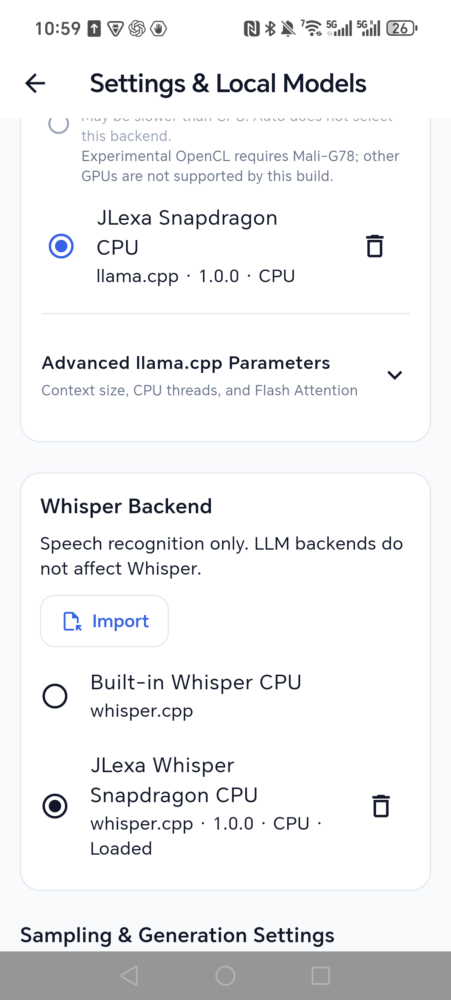
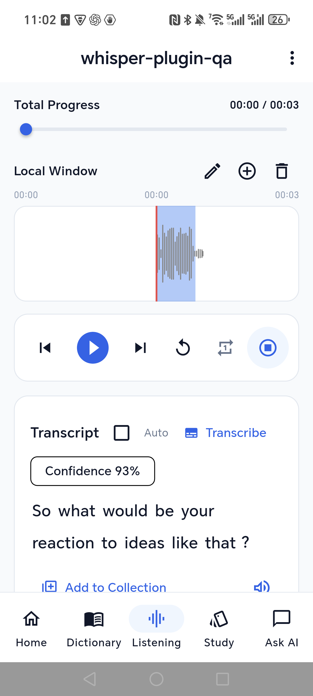
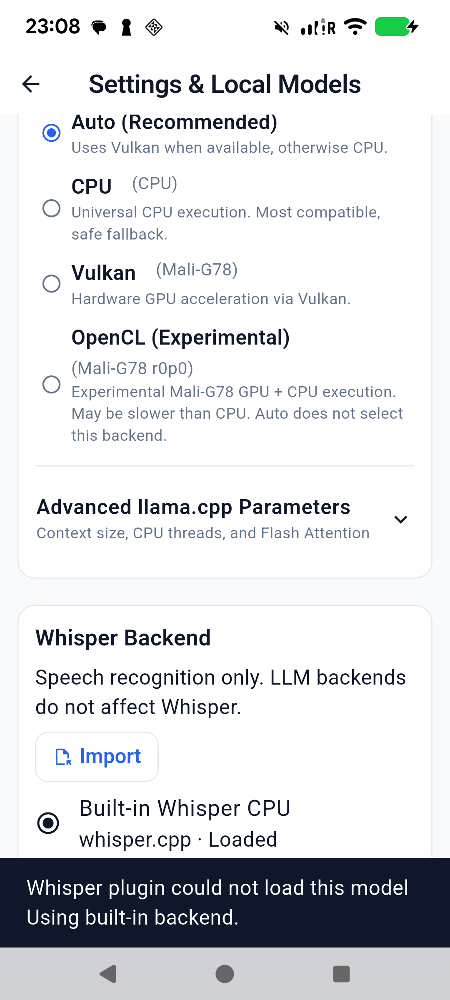

# Whisper plugins and CPU optimization — 2026-09-07

Whisper has an independent **Whisper Backend** selector in Settings, with
Import and per-entry deletion. Its default remains bundled CPU. Selecting a
speech plugin does not change the LLM backend, model, runtime settings or
benchmark history. Existing models, audio decoding, segmentation, timestamps,
confidence display and transcription cancellation are retained.

The app loads bundled and imported speech engines through a small C ABI in
`native/plugin/jlexa_speech_plugin.h`. The host's dynamic dependencies contain
only Android system libraries (`liblog`, `libdl`, `libm`, `libc`); it does not
link either inference engine. The optimized plugin exports only
`jlexa_speech_plugin_get_api`. A separate disposable speech probe process
contains constructor/API/create/destroy crashes independently of LLM probes.

## Speed measurements

Honor PTP-AN00 / Snapdragon 8 Elite, four CPU threads, the same Tiny.en model
and PCM audio. Results below are medians of three warm runs after one cold
run; model loading and audio decoding are excluded. CPU frequencies/thermals
were not locked, so these are device measurements rather than guarantees.

| Input | Generic ARMv8 CPU | Optimized CPU | Speedup |
|---|---:|---:|---:|
| 3.251-second TED question | 1,004.745 ms | 585.079 ms | 1.72× |
| 20-second TED excerpt | 1,436.210 ms | 908.381 ms | 1.58× |

The actual APK's bundled Whisper library was also measured on the short
sample: warm median 1,013.214 ms, consistent with the generic control.
Short cold runs were 1,035.742 / 595.256 ms; long cold runs were
1,442.309 / 930.901 ms for generic / optimized respectively.

Both builds produced identical text for each of these samples. The short
sample was “So what would be your reaction to ideas like that?” The longer
sample still contained Whisper Tiny recognition errors; this optimization
does not claim to improve recognition accuracy.

- Model: `ggml-tiny.en.bin`, 77,704,715 bytes; SHA-256
  `921E4CF8686FDD993DCD081A5DA5B6C365BFDE1162E72B08D75AC75289920B1F`.
- Pinned whisper.cpp revision: `c4ac0012a8f5a2082dfca6aad4ddfd8b2c02b337`.
- Same maintained engine adapter and parameters in both controls; optimized
  GGML CPU kernels use `armv8.2-a+dotprod+i8mm+fp16`, with a baseline-compiled
  capability check before creation. This is CPU optimization, not GPU/NPU.
- Pixel 6 correctly rejects this optimized build because its CPU lacks the
  required feature combination. Its generic speech plugin completed the short
  sample and stop/reset/lifecycle checks; no Pixel optimization claim is made.
- Raw host logs: `test_artifacts/whisper-honor-{baseline,optimized,long-baseline,long-optimized,bundled}.log`.
  Reproduction instructions and harness: `native/plugin/SPEECH.md` and
  `native/tests/speech_plugin_benchmark.cpp`.

## App and native verification

- Both phones imported a compatible speech `.so` through Android's picker into
  private read-only storage; selecting it retained the existing LLM selection.
- Honor selected the optimized plugin and retained its existing saved Whisper
  model outside the current folder. Pixel selected the generic speech plugin.
- A newly imported `whisper-plugin-qa.wav` lesson on each phone produced the
  complete question above with clickable word timestamps and 93% confidence.
  These were fresh inference results, not pre-existing transcript caches.
- Force-stop/relaunch restored both speech selections and their models. Honor
  retained its independent LLM Snapdragon selection as well.
- Pixel rejected speech API 99, an LLM-only plugin, unsupported optimized CPU
  instructions and a deliberate initialization abort; its selected speech
  backend remained usable. The abort was confined to `:speech_plugin_probe`.
- A valid-ABI fixture that rejects model loading imported successfully, then
  failed selection with a clear message. Built-in Whisper and the original
  model were restored; the failed fixture remained removable.
- Deleting the active generic plugin restored Pixel's built-in Whisper.
  A separate fresh 20-second lesson verified cancellation, a successful next
  transcription and normal token/confidence rendering through the fallback.
- Native harnesses verified real load/transcribe, pre-cancel, in-progress stop,
  reset/reuse, unload and destroy for generic and optimized Honor plugins,
  Pixel generic, and the actual bundled library. Expected cancellation prints
  a `failed to encode` diagnostic; this is not a process crash.
- Temporary QA lessons, transcript records and public source fixtures were
  removed. Honor keeps the optimized Whisper plugin and its import source at
  `Download/JLexa-whisper/jlexa-whisper-snapdragon-plugin.so`; Pixel uses built-in
  Whisper. Existing user models and lessons were retained.

## Release

- `flutter analyze`: No issues found, zero errors/warnings.
- `flutter test --concurrency=1`: **320 passed**, zero failures (73 seconds).
- Signed release build succeeded; final build 19 seconds after the complete
  native rebuild (85.3 seconds). Existing upstream Flutter/Kotlin notices remain.
- `apksigner verify --verbose --print-certs`: verified, v2 true.
- `release/app-release.apk`: **108,874,819 bytes**, SHA-256
  `586196D1BDD5F47DBDE0D7FA90331184830156277F177F6309A363406FF8BAFC`.
- Signer SHA-256: `6890d48ab8f1b2608392fad0f9dffad9d77f1257554b17e2a866a7d2e7d116da`.
- `release/jlexa-whisper-snapdragon-plugin.so`: **1,733,704 bytes**, SHA-256
  `1A6CB684470C39AA18FE57CCC99641C4C05BC02FE584C7CE348A1BB22B1CE500`.
- Both signed in-place installations returned Success; installed base.apk
  hashes match the fixed release artifact. Final main PIDs: Pixel 13891,
  Honor 25939; no crash entries for those PIDs.
- Prior automatic approval rejection of duplicate APK-output deletion was
  not retried/bypassed. Pre-existing untracked `artifacts/` remains untouched.

